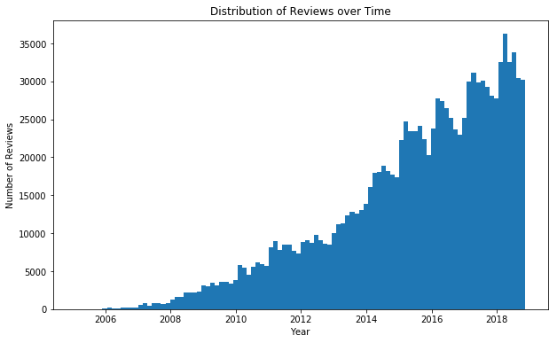
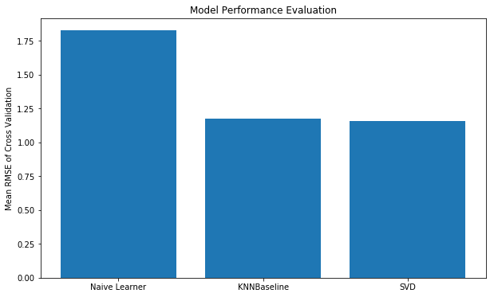

# Your Community Eatery

### Introduction
You know that friend who has such good taste in restaurants that you’ll go anywhere they recommend, no questions asked? Well guess what...there are plenty of those people out there and they’re already telling you all of the great places to go. And it just so happens we can harness them with the power of collaborative filtering. It’s like finding a whole new set of friends to show you around!

In the age of AI, why are we still searching for restaurants based on simple, manual attribute filtering and (I almost can’t even say it)...mean star rating? We deserve better than having to sort through countless images and reviews to figure out if an eatery suits our tastes. And restaurants who are actually serving their targetted customers well (even if it’s “subpar” by many people’s standards) deserves better than to be pegged as having a low rating.

Want to try it out? Give it a shot with a demo on our website: http://3.87.4.232:3333. Note, this beta version is currently only available for restaurants in the Phoenix, AZ metropolitan area. 

### How it works
Using a power of similarity-based modeling techniques, we are able to quickly and scalably unlock the hidden recommendations from all of the people whose dining preferences match yours (your tribe). 

First, we calculate the similarities of all restaurants to each other based on commonalities for which users liked/disliked them. The measure of similarity used for this model is cosine-similarity (a math term indicating the degree to which all of the ratings of the restaurants tend to "point" in the same direction, to some extent. By comparing the similarity of all restaurants based on users’ ratings, we are able to identify those restaurants which the same groups of people tend to prefer or dislike. 

For existing users that we used to train our model, we are able to generate recommendations in a highly customized manner. Given of these existing users, we calculate a predicted rating that they would give to every restaurant that they haven't yet rated. For new users that we did not have the opportunity to use to train our model (ie - users of our demo website), we follow a simpler approach in order to deliver them timely recommendations. However, in production, these users could then be added to our dataset which improves both the overall value of the model while allowing us to create more tailored recommendations for the user. 

### Technical Details
The dataset that was used to develop this recommender comes from the Yelp dataset challenge. Specifically, the data was taken from the "Business" and "Review" datasets which include the following fields:

Reviews:
Date, Cool/Funny/Useful, Stars, Text, User

Businesses
Address, City, State, Name, Avg Stars, Type, Attributes

As for the quantity of entities reflected by this data, a brief summary is provided in the list below:
190,000 Businesses
6.5 million Reviews
1.5 million Users
35 States
1,200 Cities

Given that the whole idea of the product is that it identifies "communities" of restaurants based on the network of user ratings, the concept is provable within one locale. In fact, even if a recommender were built for the entire country, there would be minimal interaction between differing geographic regions (people tend to review restaurants near where they live, and so would only get recommendations there - although with enough data, a solution could be developed to recommend in other cities as well). So, in developing an initial version of the recommender, it was desirable to select for one geographic area. The density of users to restaurants was examined in each of the major metropolitan areas included in the Yelp dataset (Las Vegas, Phoenix, Toronto, Cleveland, and Charlotte to name a few). This helped us understand the nature of the network that we would be working with in the area (desiring high ratio of users to restaurants). 

While Las Vegas had the greatest ratio of users to restaurants, it is viewed as an anomaly due to the influence of tourism. For several reasons, we would anticipate a certain bias in the dataset for Las Vegas that would differentiate it from the rest of the country and make it a poor candidate for a proof of concept project. As such, the region with the next highest ratio was taken, Phoenix, AZ. 

Taking the next step, we wanted to understand specifically what the density of reviews would be within the dataset [Density = Number of Reviews / (Number of Users * Number of Restaurants)]. Before applying any conditions, we find a density of 0.00032 for Phoenix. Low density of reviews can be a struggle for any recommender, but this was especially low. As such, we looked at several options for boosting the density.

We examined the timeframe of reviews and found that they range from 2005 to 2018. While we are comfortable going back at least a few years for reviews, 13 is a excessive. Also, the rate of reviews increased dramatically in the later years, so setting a condition on the age of review was explored as a solution to overly-aged reviews as well as possible density-booster. As such, we only took reviews from 2013 and later. The density remained steadfast at 0.00032, so it is still a success to keep the more recent reviews without hurting density.

The next consideration involved examining the number of reviews/user and reviews/restaurant. The concept here is that users who only have 1 review, aren't really helping us to make a good recommendation for them, and at the same time they are very detrimental to our density. The distribution of reviews/user and reviews/restaurant were exponentially distributed with most users having only 1 review and most restaurants less than 50. 

As such, we filtered out users who had less than 4 reviews and restaurants that had less than 40 reviews. Note that the sequential application of these operations means that one can impact the other. If we filter users first then restaurants, we eliminate some of the restaurants that were giving users their 4th review (or even 3rd). By performing one last clip for users less than 4 reviews afterward, we shore up these figures nicely (only including a few restaurants with slightly under 40 reviews which is acceptable for the time being). As a result, we are able to achieve a density of 0.00257. This number remains quite low, which poses a challenge for the accuracy of our model. However, that can be addressed with more data which can be collected over time once the product is implemented (and the product will actually incentivize more reviewing which helps). And boosting it an order of magnitude is considered a worthwhile achievement for the time being.

### Modeling
We utilized the Surprise library for recommenders to find a suitable model for this project. We compared all available models through cross validation and found that a user-item matrix factorization recommend using Singular Value Decomposition (SVD) does perform the best. Unfortunately, user-item does not allow us to make predictions for users who are outside of our dataset. As such, we focused on the models that allow for item-item similarity recommendation and found that KNNBaseline performed the best for users in the dataset. This model generates a prediction for each user in the dataset by examining a defined number (k) of its nearest neighbors while accounting for the baseline biases for each user and restaurant. And most importantly, it allows us to calculate an item-item similarity matrix that can be used for generating recommendations for new users to facilitate demonstrations on our website. 

Hyperparameters were tuned through grid-searching on both SVD and KNNBaseline and found that SVD only held a very slight edge on KNNBaseline. Additionally, both models significantly outperformed the naive learner (a "model" based on predicting ratings normally distributed around the mean of all ratings). 

### Next Iteration

Link to presentation: https://docs.google.com/presentation/d/1kzwOC0Ftm_6zt-Sk8cYTKnTqm9pXhByS3b0SL_PWpCQ/edit
